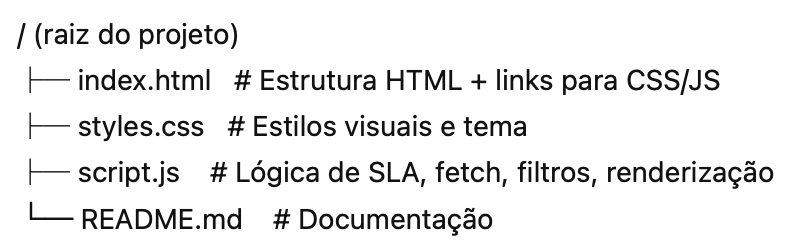

# GitLab Issues SLA Dashboard

Um dashboard estático e leve para monitorar **issues** do GitLab (Open Finance + Open Insurance), com lógica de **SLA**, filtros, ordenação e comentários locais.

🌐 **Demo:** [draftdashsla.netlify.app](https://draftdashsla.netlify.app/)

---

## 🎯 Objetivo

Auxiliar o time de Service a triar rapidamente os issues, mostrando:

- Quantos dias úteis cada issue está aberta (exclui finais de semana e feriados nacionais do Brasil — 2025 a 2030);
- Status em relação ao SLA: **Within SLA, Over SLA, SLA Paused, No SLA**;
- Agrupamento de labels por **Nature, Phase, Platform, Product, Status**;
- Filtros rápidos e comentários por issue, salvos no navegador.

---

## ⚙️ Funcionalidades

- **Projetos monitorados**  
  - Open Finance (OPF): `raidiam-conformance/open-finance/certification`  
  - Open Insurance (OPIN): `raidiam-conformance/open-insurance/open-insurance-brasil`

- **Visões**  
  - Issues abertos (`Open issues`)  
  - Issues fechados nos últimos 7 dias (`Closed in last 7 days`, via `closed_at`)

- **Taxonomia de Labels**  
  - **Nature:** `Questions`, `Bug`, `Change Request`, `Test Improvement`, `Breaking Change`  
  - **Phase:** `Phase 1`, `Phase 2`, `Phase 3`, `Phase 4a`, `Phase 4b`  
  - **Platform:** `FVP`, `Mock Bank`, `Mock TPP`, `Conformance Suite`  
  - **Status:** `Under Evaluation`, `Waiting Participant`, `Under WG/DTO Evaluation`, `In Pipeline`, `Sandbox Testing`, `Waiting Deploy`, `Production Testing`  
  - **Product:** qualquer label que não seja Nature, Phase, Platform ou Status

- **Regras de SLA (dias úteis)**  
  - `Bug` e `Questions` → 10 dias  
  - `Under Evaluation` **ou sem Nature** → 3 dias  
  - `Change Request`, `Test Improvement`, `Breaking Change` → **sem SLA**  
  - **Status pausam SLA** → `Under WG/DTO Evaluation`, `Waiting Participant`, `In Pipeline`, `Sandbox Testing`, `Waiting Deploy`, `Production Testing`  
  - Outros → **No SLA**  

  > ⚠️ *Dias úteis continuam correndo mesmo durante SLA Paused; o contador não congela.*

- **Interface**  
  - Filtros por chips (Nature, Phase, Platform, Status, Product)  
  - Ordenação por coluna (ID, Título, Criado em, Working Days, SLA) com setas ↑↓  
  - Contadores de resumo: **Total, SLA-applicable, Over SLA**  
  - Estados vazios explicativos  
  - Botões: **Refresh, Reset filters, Clear all comments**  
  - Links diretos para as listas de issues no GitLab  
  - Tema **dark**

- **Comentários locais**  
  - Campo de texto inline + botão **Edit** que abre modal para edição maior  
  - Salvos em `localStorage` (limpos se o cache do navegador for apagado)

---

## 🚀 Como rodar localmente

1. Baixe os três arquivos: `index.html`, `styles.css`, `script.js`
2. Coloque todos na mesma pasta
3. Abra `index.html` direto no navegador

> ⚡ Não precisa de build, servidor ou variáveis de ambiente.  
> Tudo roda via chamadas públicas da API do GitLab.

---

## 🌐 Deploy

Para publicar em plataformas como **Netlify** ou **Vercel**:

1. Suba os arquivos para um repositório (GitHub, GitLab etc.)
2. Conecte o repositório na plataforma de deploy
3. Configure como site **estático**

---

## 📁 Estrutura

---

## 📌 Limitações

- Assume a taxonomia de labels definida acima  
- Não considera feriados estaduais ou municipais  
- Apenas issues abertos ou fechados nos últimos 7 dias  
- Comentários armazenados apenas no navegador (sem backend)

---

## 🙏 Créditos

Construído como **prova de conceito (PoC)** para apoiar a triagem rápida de issues nos ecossistemas Open Finance e Open Insurance Brasil.
